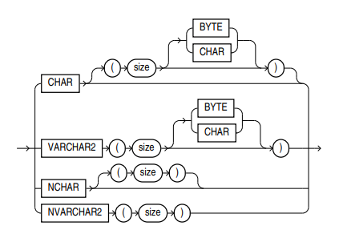
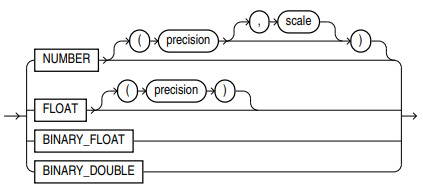
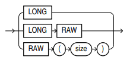
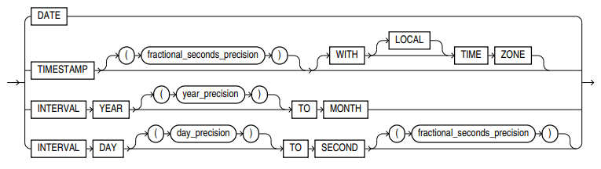

# 
Oracle Notes

---  

### 
Table of Contents
  
|Item|Heading|Sub Contents|
|:---:|:---:|:---:|
| **1.** | [Reference Links](#reference-links) ||
| **2.** | [Notes](#notes) ||
| **3.** | [Comments](#comments) |  |
| **4.** | [Oracle Built in Types](#oracle-built-in-data-types) | [Character data types](#character-data-types), [Number data types](#number-data-types), [Long & raw data types](#long--raw-data-types), [Date time data types](#date-time-data-types) |
| **5.** | [Structured Types - User Defined](#structured-types---user-defined) | [Retrieve all user types](#retrieve-all-user-types), [Drop a type](#drop-a-type), [Declare user defined type](#declare-user-defined-type), [Declaring types with a reference field](#declaring-types-with-a-reference-field), [Methods](#methods), [Access methods](#access-methods), [Inheritance & hierarchy](#inheritance--hierarchy), [Access components of a composite attribute](#access-components-of-a-composite-attribute), [Alter types](#alter-types) |
| **6.** | [Tables](#tables) | [Retrieve all user tables](#retrieve-all-user-tables), [Retrieve table attribute details](#retrieve-table-attribute-details), [Retrieve object identifier reference](#retrieve-object-identifier-reference), [Drop a table](#drop-a-table), [Create tables](#create-tables), [Create table of user objects](#create-table-of-user-objects), [Create tables with reference columns](#create-tables-with-reference-columns), [Inserting into a table](#inserting-into-a-table), [Alter tables](#alter-tables) |
| **7.** | [Constraints](#constraints) | [Constraint types](#constraint-types), [Using constraints](#using-constraints) |
| **8.** | [Functions](#functions) | [Retrieve all user functions](#retrieve-all-user-functions), [Create functions](#create-functions), [Access functions](#access-functions), [Ref() function](#ref-function), [Value() function](#value-function), [Deref() function](#deref-function) |
| **9.** | [Oracle Reserved Words](#oracle-reserved-words) ||

 

[⬆ Table of Contents ⬆](#oracle-notes)    

---  

### <u>Reference Links</u>  

[Database Documentation](https://docs.oracle.com/en/database/oracle/oracle-database/)  
[SQL Language Reference](https://docs.oracle.com/en/database/oracle/oracle-database/21/sqlrf/#Oracle%C2%AE-Database)  
[Normalisation Cheat Sheet](https://medium.com/@athishakaliannan/database-normalization-cheat-sheet-873964ab8cd2)  

   

[Basic Components of Oracle Objects](https://docs.oracle.com/en/database/oracle/oracle-database/21/adobj/basic-components-of-oracle-objects.html#GUID-E2DD59A0-3FFC-4AC2-9A1B-4E457275BE0B)  
[More on Basic Components & Working With Objects](https://docs.oracle.com/cd/B10501_01/appdev.920/a96594/adobjbas.htm)  

   

[⬆ Table of Contents ⬆](#oracle-notes)    

---  

### <u>Notes</u>  

* When using Oracle and SQLDeveloper, it can be good practice to **prefix types and tables** so all user defined objects are grouped together (try prefixing with initials and underscore `ad_name`)  
* `/` is a command delimeter and allows multiple blocks to be executed sequentially. **Add after each block statement/queries**  
* Careful using quotation marks. `'` is allowed, `‘` and `"` are not  

[⬆ Table of Contents ⬆](#oracle-notes)    

---  

### <u>Comments</u>  

`--` - Single line comment  
`/* */` - Multi line comment  

---  

### <u>Oracle Built in Types</u>  

##### Oracle built in data types:  
  

##### Character data types:  
  
* `VARCHAR2` maximum bytes of characters 4000  
* `VARCHAR` is also allowed, but **not recommended**, max bytes of characters 2000  

##### Number data types:  
  

##### Long & raw data types:  
  

##### Date time data types:  
  

[⬆ Table of Contents ⬆](#oracle-notes)    

---  

### <u>Structured Types - User Defined</u>  

Oracle, object-oriented models and object-relational models allow for composite attributes (non-atomic) and structured types (user defined types) along with nested relations (relations (tables) have ability to contain other relations). Note this violates 1NF, but representation is much more natural.  

   

##### Retrieve all user types:
`SELECT * FROM user_types;`  
`/`  
* Retrieves information about user-defined types **(object types, collection types, etc.)** owned by the currently logged-in user  

   

##### Drop a type:  
`DROP TYPE` Type_name `FORCE;`  
`/`  
* `/` is a command delimeter and allows blocks to be executed individually - not always required  
* `FORCE` keyword removes dependencies, without keyword, will raise error and not remove type if dependencies exist  

   

##### Declare user defined type:  
`CREATE TYPE` Type_name `AS OBJECT (`  
&emsp;Attribute TYPE(SIZE)`,` - Size may not be required, depends on type  
&emsp;Attribute TYPE`,`  
&emsp;`MEMBER FUNCTION` method_name`(` param_name PARAM_TYPE`) RETURN` RETURN_TYPE  
`) FINAL;`  
`/`  
* Multiple attributes can be specified, last should not be followed by a comma (unless followed by member functions)   
* **Attributes can be composite** (i.e. another user defined type defined with multiple components)  
* `MEMBER FUNCTION` is a type method, note the **definition should be separate from the type definition**. They are only declared in the type definition. [See here](#methods). **These are member methods** and operate on **instance-specific data** (invoked on individual instances). <u>Prefix with `STATIC`</u> to declare as a **static method** operate at **class level** (invoked on class directly)  
* **Note, method datatypes** are STRING, REAL and NUMBER (not INT or VARCHAR)  
* `FINAL` is not required:  
  * `FINAL` **does not allow subtypes** (other types cannot inherit from declared type)  
  * `NOT FINAL` (or omitting `FINAL`) **allows subtypes**  
* Use `CREATE OR REPLACE TYPE ...` to **overwrite existing tables** and not throw an error if table already exists. Though this **only works** if the type **does not have dependant tables** (otherwise it can only be [altered](#alter-types))  
* If a **type creation is unsuccessful**, Oracle usually only provides a warning "created with compilation errors". To obtain more information, type `SHOW ERROR;`  

   

##### Declaring types with a reference field:  
`CREATE TYPE` Type_name `AS OBJECT (`  
&emsp;Attribute `REF` TYPE  
`) FINAL;`  
`/`  
* The `REF` attribute is a logical "pointer" to a **row object** (tuple)  
* This points to the object types, **not** the relevant tables  
* All other parts of declaring the type are the same as above ([declaring user-type](#declare-user-defined-type))  

   

##### Methods:  
`CREATE OR REPLACE TYPE BODY` Type_name `AS`  
&emsp;`MEMBER FUNCTION` method_name `RETURN` RETURN_TYPE `IS`  
&emsp;variable_name TYPE`;`  
&emsp;`BEGIN`  
&emsp;`IF` self.Attribute = value `THEN`  
&emsp;&emsp;self.Attribute := new_value`;`  
&emsp;&emsp;variable_name := new_value`;`
&emsp;`RETURN` return_value/variable  
&emsp;`ELSIF` self.Attribute IS NOT NULL `THEN`  
&emsp;&emsp;-- code block if condition is true  
&emsp;`ELSE`  
&emsp;&emsp;-- code block if no above conditions are true  
&emsp;`ENDIF`  
&emsp;`RETURN` variable_name`;`  
&emsp;`END` method_name`;`  
`END;`  
`/`  
* Methods should be **defined outside type declaration** ([but declared inside the type](#declare-user-defined-type) (or added later))  
* `STATIC` methods are defined in the same way, but `MEMBER FUNCTION` should be prefixed with `STATIC`  
* **Note, method datatypes** are STRING, REAL and NUMBER (not INT or VARCHAR)  
* **Note** `=` is used for **comparison**, whereas `:=` is used for **assignment**  
* `self.` is used to refer to **object instance**  
* `!=` **does NOT work** in some databases, use `IS NOT NULL` or equivalent  
* `if..else` blocks and `variables` are optional, and provided here for example  
* **Multiple methods** can be defined between the `CREATE OR REPLACE...` and final `END` statements. Note types (and hence methods) can **not be replaced** if they have dependencies, in this case they can **only be** [altered](#alter-types)  
* If method was not declared originally when type was defined, need to [add member function](#alter-types)  
* Methods are typically used to define behavior specific to an object type, whereas [functions](#create-functions) are more general-purpose and can be used in a wide range of scenarios throughout the database  

   

##### Access methods:  
`SELECT` * `FROM` Table_name alias  
`WHERE` alias.method_name`(`argument`)` condition`;`  
* Need to mention which table method belongs to  
* Parenthesis are always required, even if the method has no arguments  

**OR**  

`SELECT` TYPE.method_name`(`argument`) AS` output_column_name `FROM DUAL;`  
* `DUAL` is a special one-row, one-column table present in Oracle databases. Often used in scenarios where you need to execute a SQL query that doesn't require any specific table  
* `DUAL` has a single column named `DUMMY` and a single row containing the value `X`  

   

##### Inheritance & hierarchy:  
`CREATE TYPE` Subtype_name `UNDER` Direct_supertype_name `(`  
&emsp;Attribute TYPE`,`  
&emsp;Attribute TYPE  
`) FINAL;`  
`/`  
* The supertype which subtype inherits from must be `NOT FINAL`  
* Multiple inheritence is possible in **some type systems** (not SQLPlus), This can be achieved by comma separating the supertypes the subtype inherits from. Avoid naming conflictions of attributes with `AS`:  
&emsp;`CREATE TYPE` Subtype_name  
&emsp;`UNDER` first_subtype`(`attribute `AS` new_attribute_name`),`  
&emsp;&emsp;&emsp;&ensp;&ensp;second_subtype`(` attribute `AS` new_attribute_name`)`
* Supertype components of the subtype can be accessed in the normal way via the subtype:  
&emsp;`SELECT` alias`.`super_attrubute  
&emsp;`FROM` Table_of_subtypes_name alias`;`  
&emsp;`/`  

   

##### Access components of a composite attribute:  
`SELECT` alias`.`composite_attribute`.`component  
`FROM` table alias`;`  
`/`  
* Allows access to a specific component of a structured type composite attribute using dot notation  

   

##### Alter types:  
`ALTER TYPE` Type_name  
`ADD ATTRIBUTE` `(`Attribute TYPE`) CASCADE;`  
`/`  
* `CASCADE` propagates a type change to dependant types and tables  
* Other options as opposed to `ADD ATTRIBUTE`:  
  * `NOT FINAL` / `FINAL`  
  * `MODIFY ATTRIBUTE` - change data type of existing attribute  
  * `DROP ATTRIBUTE` - does not require TYPE, just Attribute  
  * `ADD MEMBER FUNCTION` method_name `RETURN` TYPE - adds a method  
  * `MODIFY MEMBER FUNCTION` method_name `RETURN` TYPE - change return type of existing method  
  * `DROP MEMBER FUNCTION` method_name - drop method  

[⬆ Table of Contents ⬆](#oracle-notes)    

---  

### <u>Tables</u>  

##### Retrieve all user tables:  
`SELECT * FROM user_objects;`  
* Retrieves information about all objects **(tables, views, indexes, procedures, functions, etc.)** owned by the currently logged-in user  

   

##### Retrieve table attribute details:  
`DESCRIBE` Table_name`;`  
* Returns names, datatypes, and nullable status of each column in the table  

   

##### Retrieve object identifier reference:  
`SELECT SYS_NC_OID$`  
`FROM` Table_name`;`  
* Returns object identifier for all rows (careful using with large tables)  
* Can be used with `WHERE` clause to further filter rows, or retrieve identifier for a specific row  
* A reference is generated by the system automatically for each row in a table. These are pointers to tuples (rows)  

   

##### Drop a table:  
`DROP TABLE` Table_name `CASCADE CONSTRAINTS;`  
`/`  
* `CASCADE CONSTRAINTS` is optional, and will drop table along with dependent objects (constraints, indexes, triggers, etc.) without raising errors  

   

##### Create tables:  
`CREATE TABLE` Table_name `(`  
&emsp;Column1_name `TYPE` CONSTRAINT`,`  
&emsp;Column2_name `TYPE,`  
&emsp;`CONSTRAINT` constraint_name CONSTRAINT
`);`  
`/`  
* Constraints are optional, [see below](#constraints)  

   

##### Create table of user objects:  
`CREATE TABLE` Table_name `OF` object_type_name`(`  
&emsp;`CONSTRAINT` ...  
`);`  
`/`  
* Creates a table associated with specific user-defined objects where each row represents an instance of that object type  
* `CONSTRAINT` is optional, [see below](#constraints)  

   

##### Create tables with reference columns:  
`CREATE TABLE` Table_name `(`  
&emsp;Column1_name `REF` TYPE `SCOPE IS` Reference_table_name  
`);`  
`/`  
* This makes references behave like **foreign keys**  
* `SCOPE IS` is used to restrict the references to point at the **actual object table**. Without this, the reference can be any table of the TYPE  
* For object-relational model where there are complex object types and relationships between them (inheritance, subtype relationships, or multiple levels of composition), using `REF` may be more appropriate than the foreign key constraint as it provides a more natural representation of these relationships  
* `REF` **does not enforce referential integrity directly** (like foreign key does). It is up to the application or database logic to ensure that the references stored in the `REF` column are valid  
* `REF` **does not have built-in support for cascading actions**. Any cascading behavior must be implemented manually using triggers or application logic  
* `REF` **allows** you to **query related data across tables** ([see functions below](#ref-function)). While with foreign keys, `JOIN` would typically be used  

   

##### Inserting into a table:  
`INSERT INTO` Table_name  
`VALUES (`  
&emsp;User_type_name(value1, value2,...)`,`  
&emsp;built_in_value1`,`  
&emsp;built_in_value2  
`);`  
`/`  
* User-defined types require using the constructor syntax (**type name and parentheses**)  
* Built in values can be passed directly  
* Values **must be passed in order** corresponding to order of columns in the table  
* `Ref()` **function** can be used to insert data into a table ([see ref function](#ref-function))  
* Carful using quotations `'` is allowed, `‘` and `"` are not  

   

##### Alter tables:  
`ALTER TABLE` Table_name  
OPTION`;`  
`/`  
* OPTIONS:  
  * `ADD` 
&emsp;&emsp;column_name TYPE - adds a column  
&emsp;&emsp;`PRIMARY KEY (`column_name`)` - add primary key  
&emsp;&emsp;`FOREIGN KEY(`col_name`) REFERENCES` Parent_table`(`parent_col`)` - add foreign key (**note** - using `REF` (above) may be more appropriate for object-relational models)  
&emsp;&emsp;`CONSTRAINT` constraint_name CONSTRAINT `(`Attribute`)` - add a named constraint  
  * `MODIFY`  
&emsp;&emsp;column_name TYPE - change column type  
&emsp;&emsp;column_name `DEFAULT` default_value - add a default value  
  * `RENAME COLUMN` old_col_name `TO` new_col_name - rename column  
  * `DROP`  
&emsp;&emsp;`COLUMN` column_name - drop column  
&emsp;&emsp;`PRIMARY KEY` - remove primary key  
&emsp;&emsp;`CONSTRAINT` constraint_name - remove constraint (including forign key)  
  * `ENABLE CONSTRAINT` constraint_name - enable constraint  
  * `DISABLE CONSTRAINT` constraint_name - disable constraint  

[⬆ Table of Contents ⬆](#oracle-notes)    

---  

### <u>Constraints</u>  

[Reference <u>p757</u>](https://docs.oracle.com/en/database/oracle/oracle-database/21/sqlrf/sql-language-reference.pdf)  

##### Constraint types:  
`NOT NULL` - prohibits value being null  
`UNIQUE` - prohibits multiple rows having same value in same column or combination of columns but allows some values to be null  
`PRIMARY KEY` - combines `NOT NULL` constraint and `UNIQUE` constraint  
`REFERENCES` Table_name`(`Attribute`)` - (foreign key) requires values in one table to match the ones specified in another table  
&emsp;&emsp;If naming foreign key constraint, must use `CONSTRAINT` and `FOREIGN KEY` keywords ([see below](#using-constraints))  
`CHECK (`Condition_or_query`)` - value must comply with specified condition. Can be chained with other conditions of queries using `AND` / `OR`  
`DEFAULT '`value`'` - provides a default value  

   

##### Using constraints:  
`CREATE TABLE` Table_name `(`  
&emsp;Attribute TYPE CONSTRAINT`,` - specifying constraint on attribute  
&emsp;`CONSTRAINT` constraint_name CONSTRAINT`,` - naming a constraint  
&emsp;`CONSTRAINT` constraint_name `FOREIGN KEY (`Attribute`) REFERENCES` Table_name`(`Attribute`)` - naming a foreign key constraint   
`);`  
`/`  
* `CONSTRAINT` keyword is used when naming a constraint, otherwise Oracle will automatically generate a name  
* `CONSTRAINT` keyword **must** be used if wanting to define a single constraint on multiple columns (e.g. composite primary key)  

[⬆ Table of Contents ⬆](#oracle-notes)    

---  

### <u>Functions</u>  

##### Retrieve all user functions:  
`SELECT * FROM user_source;`  
* Retrieves the source code of **stored procedures, functions, packages, and triggers** owned by the currently logged-in user  

   

##### Create functions:  
`CREATE OR REPLACE FUNCTION` function_name`(`param_name PARAM_TYPE`)` 
`RETURN` RETURN_TYPE  
`IS`  
&emsp;variable_name TYPE`;`  
`BEGIN`  
&emsp;-- procedure (if no return statement, otherwise function)  
&emsp;`SET` variable_name = param_name`;`  
&emsp;`RETURN` variable_name`;`  
`END` function_name`;`  
`/`  
* Note when using keyword `SET`, `=` is used for assignment, otherwise use `:=` and `=` is used for comparison   
* Note, **function datatypes** are STRING, REAL and NUMBER (not INT or VARCHAR)   
* Parameters are optional  
* Use of variables is optional  
* `Return` statements are not required if just processing  
* `if..else` blocks can be used similar to [methods](#methods)  
* Functions are standalone units of code that can be called from anywhere in the database where PL/SQL is supported. They are not directly tied to a specific type or table  
* While methods are typically used to define behavior specific to an object type, functions are more general-purpose and can be used in a wide range of scenarios throughout the database  

   

##### Access functions:  
`SELECT` function_name`(`argument`)` `INTO` variable `FROM dual;`  
* Functions can be accessed by calling directly inside of functions, alternatively, use as shown above  
* `INTO` statement is optional and assigns retrieved value into the variable  

   

##### Ref() function:  

* Takes its **argument** as a **table alias** associated with a row of an object table  
* **Returns** the **reference to that object**  
* Mainly used for inserting data  
* **QUERY RELATED DATA (to find related data)**  
* **INSERT DATA**  

   

##### Value() function:  

* Takes its **argument** as a **table alias** associated with a row of an object table  
* **Returns object instances stored in the table object**  
* **QUERY TO FIND OBJECT INSTANCES IN A TABLE**  
* **TRY SELECT * FROM TABLE WHERE...**  

   

##### Deref() function:  

* Takes its **argument** as a **reference** to an object  
* **Returns instance of object type** (tuple pointed to by a reference)  
* **QUERY**  

[⬆ Table of Contents ⬆](#oracle-notes)    

---  

### <u>Oracle Reserved Words</u>  

Below is the commonly recognised Oracle reserved words which cannot be used as identifiers, such as table names, column names, variable names, or aliases  

|||||
|:--|:--|:--|:--|
|ACCESS|ADD|ALL|ALTER|
|AND|ANY|AS|ASC|
|AUDIT|BETWEEN|BY|CHAR|
|CHECK|CLUSTER|COLUMN|COMMENT|
|COMPRESS|CONNECT|CREATE|CURRENT|
|DATE|DECIMAL|DEFAULT|DELETE|
|DESC|DISTINCT|DROP|ELSE|
|EXCLUSIVE|EXISTS|FILE|FLOAT|
|FOR|FROM|GRANT|GROUP|
|HAVING|IDENTIFIED|IMMEDIATE|IN|
|INCREMENT|INDEX|INITIAL|INSERT|
|INTEGER|INTERSECT|INTO|IS|
|LEVEL|LIKE|LOCK|LONG|
|MAXEXTENTS|MINUS|MLSLABEL|MODE|
|MODIFY|NOAUDIT|NOCOMPRESS|NOT|
|NOWAIT|NULL|NUMBER|OF|
|OFFLINE|ON|ONLINE|OPTION|
|OR|ORDER|PCTFREE|PRIOR|
|PUBLIC|RAW|RENAME|RESOURCE|
|REVOKE|ROW|ROWID|ROWNUM|
|ROWS|SELECT|SESSION|SET|
|SHARE|SIZE|SMALLINT|START|
|SUCCESSFUL|SYNONYM|SYSDATE|TABLE|
|THEN|TO|TRIGGER|UID|
|UNION|UNIQUE|UPDATE|USER|
|VALIDATE|VALUES|VARCHAR|VARCHAR2|
|VIEW|WHENEVER|WHERE|WITH|  

[⬆ Table of Contents ⬆](#oracle-notes)    

---  
