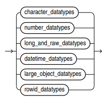

# 
Oracle Notes

[Database Documentation](https://docs.oracle.com/en/database/oracle/oracle-database/)  
[SQL Language Reference](https://docs.oracle.com/en/database/oracle/oracle-database/21/sqlrf/#Oracle%C2%AE-Database)  
[Normalisation Cheat Sheet](https://medium.com/@athishakaliannan/database-normalization-cheat-sheet-873964ab8cd2)  

### 
Table of Contents
  
|Item|Heading|Sub Contents|
|:---:|:---:|:---:|
| **1.** | [Comments](#comments) |  |
| **2.** | [Oracle Built in Types](#oracle-built-in-data-types) | [Character data types](#character-data-types), [Number data types](#number-data-types), [Long & raw data types](#long--raw-data-types), [Date time data types](#date-time-data-types) |
| **3.** | [Structured Types - User Defined](#structured-types---user-defined) | [Retrieve all user types](#retrieve-all-user-types), [Drop a type](#drop-a-type), [Declare user defined type](#declare-user-defined-type), [Inheritance & hierarchy](#inheritance--hierarchy), [Access components of a composite attribute](#access-components-of-a-composite-attribute), [Alter types](#alter-types) |
| **4.** | [Tables](#tables) | [Retrieve all user tables](#retrieve-all-user-tables), [Drop a table](#drop-a-table), [Create tables](#create-tables), [Create table of user objects](#create-table-of-user-objects), [Inserting into a table](#inserting-into-a-table), [Alter tables](#alter-tables) |
| **5.** | [Constraints](#constraints) | [Constraint types](#constraint-types), [Using constraints](#using-constraints) |
| **6.** | [Functions](#functions) | [Retrieve all user functions](#retrieve-all-user-functions) |

 

[⬆ Table of Contents ⬆](#oracle-notes)    

---  

### <u>Comments</u>  

`--` - Single line comment  
`/* */` - Multi line comment  

---  

### <u>Oracle Built in Types</u>  

##### Oracle built in data types:  
  

##### Character data types:  
  
* `VARCHAR2` maximum bytes of characters 4000  
* `VARCHAR` is also allowed, but **not recommended**, max bytes of characters 2000  

##### Number data types:  
  

##### Long & raw data types:  
  

##### Date time data types:  
  

[⬆ Table of Contents ⬆](#oracle-notes)    

---  

### <u>Structured Types - User Defined</u>  

Oracle, object-oriented models and object-relational models allow for composite attributes (non-atomic) and structured types (user defined types) along with nested relations (relations (tables) have ability to contain other relations). Note this violates 1NF, but representation is much more natural.  

   

##### Retrieve all user types:
`SELECT * FROM user_types;`  
`/`  
* Retrieves information about user-defined types **(object types, collection types, etc.)** owned by the currently logged-in user  

   

##### Drop a type:  
`DROP TYPE` Type_name `FORCE;`  
`/`  
* `/` is a command delimeter and allows blocks to be executed individually - not always required  
* `FORCE` keyword removes dependencies, without keyword, will raise error and not remove type if dependencies exist  

   

##### Declare user defined type:  
`CREATE TYPE` Type_name `AS OBJECT (`  
&emsp;Attribute TYPE(SIZE)`,` - Size may not be required, depends on type  
&emsp;Attribute TYPE  
`) FINAL;`  
`/`  
* Multiple types can be specified, last should not be followed by a comma   
* **Attributes can be composite** (i.e. another user defined type defined with multiple components)  
* `FINAL` is not required:  
  * `FINAL` **does not allow subtypes** (other types cannot inherit from declared type)  
  * `NOT FINAL` (or omitting `FINAL`) **allows subtypes**  

   

##### Inheritance & hierarchy:  
`CREATE TYPE` Subtype_name `UNDER` Direct_supertype_name `(`  
&emsp;Attribute TYPE`,`  
&emsp;Attribute TYPE  
`) FINAL;`  
`/`  
* The supertype which subtype inherits from must be `NOT FINAL`  
* Supertype attributes of the subtype can be accessed in the normal way via the subtype -  
&emsp;`SELECT` alias`.`super_attrubute  
&emsp;`FROM` Table_of_subtypes_name alias`;`  
&emsp;`/`  

   

##### Access components of a composite attribute:  
`SELECT` alias`.`composite_attribute`.`component  
`FROM` table alias`;`  
`/`  
* Allows access to a specific component of a structured type composite attribute using dot notation  

   

##### Alter types:  
`ALTER TYPE` Type_name  
`ADD ATTRIBUTE` `(`Attribute TYPE`) CASCADE;`  
`/`  
* `CASCADE` propagates a type change to dependant types and tables  
* Other options as opposed to `ADD ATTRIBUTE`:  
  * `NOT FINAL` / `FINAL`  
  * `MODIFY ATTRIBUTE` - change data type of existing attribute  
  * `DROP ATTRIBUTE` - does not require TYPE, just Attribute  
  * `ADD MEMBER FUNCTION` method_name `RETURN` TYPE - adds a method  
  * `MODIFY MEMBER FUNCTION` method_name `RETURN` TYPE - change return type of existing method  
  * `DROP MEMBER FUNCTION` method_name - drop method  

[⬆ Table of Contents ⬆](#oracle-notes)    

---  

### <u>Tables</u>  

##### Retrieve all user tables:  
`SELECT * FROM user_objects;`  
* Retrieves information about all objects **(tables, views, indexes, procedures, functions, etc.)** owned by the currently logged-in user  

   

##### Drop a table:  
`DROP TABLE` Table_name `CASCADE CONSTRAINTS;`  
`/`  
* `CASCADE CONSTRAINTS` is optional, and will drop table along with dependent objects (constraints, indexes, triggers, etc.) without raising errors  

   

##### Create tables:  
`CREATE TABLE` Table_name `(`  
&emsp;Column1_name `TYPE` CONSTRAINT`,`  
&emsp;Column2_name `TYPE,`  
&emsp;`CONSTRAINT` constraint_name CONSTRAINT
`);`  
`/`  
* Constraints are optional, see below  

   

##### Create table of user objects:  
`CREATE TABLE` Table_name `OF` object_type_name`(`  
&emsp;`CONSTRAINT` ...  
`);`  
`/`  
* Creates a table associated with specific user-defined objects where each row represents an instance of that object type  
* `CONSTRAINT` is optional, see below  

   

##### Inserting into a table:  
`INSERT INTO` Table_name  
`VALUES (`  
&emsp;User_type_name(value1, value2,...)`,`  
&emsp;built_in_value1`,`  
&emsp;built_in_value2  
`);`  
`/`  
* User-defined types require using the constructor syntax (type name and parentheses)  
* Built in values can be passed directly  
* Values **must be passed in order** corresponding to order of columns in the table  

   

##### Alter tables:  
`ALTER TABLE` Table_name  
OPTION`;`  
`/`  
* OPTIONS:  
  * `ADD` 
&emsp;&emsp;column_name TYPE - adds a column  
&emsp;&emsp;`PRIMARY KEY (`column_name`)` - add primary key  
&emsp;&emsp;`FOREIGN KEY(`col_name`) REFERENCES` Parent_table`(`parent_col`)` - add foreign key  
&emsp;&emsp;`CONSTRAINT` constraint_name CONSTRAINT `(`Attribute`)` - add a named constraint  
  * `MODIFY`  
&emsp;&emsp;column_name TYPE - change column type  
&emsp;&emsp;column_name `DEFAULT` default_value - add a default value  
  * `RENAME COLUMN` old_col_name `TO` new_col_name - rename column  
  * `DROP`  
&emsp;&emsp;`COLUMN` column_name - drop column  
&emsp;&emsp;`PRIMARY KEY` - remove primary key  
&emsp;&emsp;`CONSTRAINT` constraint_name - remove constraint (including forign key)  
  * `ENABLE CONSTRAINT` constraint_name - enable constraint  
  * `DISABLE CONSTRAINT` constraint_name - disable constraint  

[⬆ Table of Contents ⬆](#oracle-notes)    

---  

### <u>Constraints</u>  

[Reference <u>p757</u>](https://docs.oracle.com/en/database/oracle/oracle-database/21/sqlrf/sql-language-reference.pdf)  

##### Constraint types:  
`NOT NULL` - prohibits value being null  
`UNIQUE` - prohibits multiple rows having same value in same column or combination of columns but allows some values to be null  
`PRIMARY KEY` - combines `NOT NULL` constraint and `UNIQUE` constraint  
`REFERENCES` Table_name`(`Attribute`)` - (foreign key) requires values in one table to match the ones specified in another table  
&emsp;&emsp;If naming foreign key constraint, must use `CONSTRAINT` and `FOREIGN KEY` keywords (see below)  
`CHECK (`Condition_or_query`)` - value must comply with specified condition. Can be chained with other conditions of queries using `AND` / `OR`  
`DEFAULT '`value`'` - provides a default value  

   

##### Using constraints:  
`CREATE TABLE` Table_name `(`  
&emsp;Attribute TYPE CONSTRAINT`,` - specifying constraint on attribute  
&emsp;`CONSTRAINT` constraint_name CONSTRAINT`,` - naming a constraint  
&emsp;`CONSTRAINT` constraint_name `FOREIGN KEY (`Attribute`) REFERENCES` Table_name`(`Attribute`)` - naming a foreign key constraint   
`);`  
`/`  
* `CONSTRAINT` keyword is used when naming a constraint, otherwise Oracle will automatically generate a name  
* `CONSTRAINT` keyword **must** be used if wanting to define a single constraint on multiple columns (e.g. composite primary key)  

[⬆ Table of Contents ⬆](#oracle-notes)    

---  

### Functions  

##### Retrieve all user functions:  
`SELECT * FROM user_source;`  
* Retrieves the source code of **stored procedures, functions, packages, and triggers** owned by the currently logged-in user  

[⬆ Table of Contents ⬆](#oracle-notes)    

